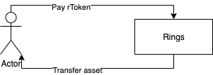
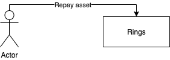

# compound

An implementation of the [compound protocol](https://github.com/compound-finance/compound-protocol) based on [Mixin](https://github.com/MixinNetwork/mixin) [MTG](https://github.com/MixinNetwork/developers.mixin.one/blob/main/developers/src/i18n/en/document/mainnet/mtg.md) technology.

## Key Words

### [Mixin(Mixin network)](https://github.com/MixinNetwork/mixin)
A public blockchain driven by TEE (Trusted Execution Environment) based on the DAG with aBFT. Unlike other projects which have great theories but hardly any actual implementations of blockchain transaction solution, Mixin Network provides a more secure, private, 0 fees, developer-friendly and user-friendly transaction solution with lightning speed.

### [MTG(Mixin Trusted Group)](https://github.com/MixinNetwork/developers.mixin.one/blob/main/developers/src/i18n/en/document/mainnet/mtg.md)

An alternative to smart contacts on Mixin Network.

Basically, MTG is a Multi-signature custodian consensus solution. Several teams will be selected and arranged as the “Trusted Group” in Pando, becoming the “Nodes”. Concensus has to be reached among the nodes to perform certain administrative actions. As a result, stable services and asset safety are guaranteed.

For example, let’s say there is a M/N multi-sig group where M represents the number of nodes, and the group manages some assets in the multi-sig address. When one of the nodes needs to transfer some assets out, it needs to collect at least N signatures from others to perform the action.

MTG is the framework. Pando is an application designed using the framework on Mixin Network.

### CToken

The corresponding certificate token you obtain after you supply a number of cetain encrypted currency to the market.

## Functions

#### Supply

Users supply encrypted currencies to the market to provide liquidity, 
and obtain the corresponding ctokens. They receive interest yields by providing liquidity.


#### Pledge

Users have to pledge cToken to the market before any borrow.


#### Unpledge

Users take back the cToken that pledged to the market.


#### Redeem

Users return the CToken in exchange for corresponding encrypted currency that were supplied before, including interest yields as the reward for providing liquidity. 



#### Borrow

Users borrow encrypted currencies from the market at a certain interest rate.


#### Repay

Users repay the borrowed encrypted currency and the interest accrued during the borrow period.



#### Liquidation

Due to the fluctuation of the market price, the value of a user's loan may exceed that of his pledged assets. When that happens, the other users can use a lower price to obtain the user's pledged assets so that the user's debt that are not covered by pleged assets are repayed.     


## [Design](docs/design.md)

## [Deployment](docs/deploy.md)

## [Governance](docs/governance.md)

## [Userguide](docs/userguide.md)

## [LICENSE](LICENSE)

```

MIT License

Copyright (c) 2020 Fox.ONE

Permission is hereby granted, free of charge, to any person obtaining a copy
of this software and associated documentation files (the "Software"), to deal
in the Software without restriction, including without limitation the rights
to use, copy, modify, merge, publish, distribute, sublicense, and/or sell
copies of the Software, and to permit persons to whom the Software is
furnished to do so, subject to the following conditions:

The above copyright notice and this permission notice shall be included in all
copies or substantial portions of the Software.

THE SOFTWARE IS PROVIDED "AS IS", WITHOUT WARRANTY OF ANY KIND, EXPRESS OR
IMPLIED, INCLUDING BUT NOT LIMITED TO THE WARRANTIES OF MERCHANTABILITY,
FITNESS FOR A PARTICULAR PURPOSE AND NONINFRINGEMENT. IN NO EVENT SHALL THE
AUTHORS OR COPYRIGHT HOLDERS BE LIABLE FOR ANY CLAIM, DAMAGES OR OTHER
LIABILITY, WHETHER IN AN ACTION OF CONTRACT, TORT OR OTHERWISE, ARISING FROM,
OUT OF OR IN CONNECTION WITH THE SOFTWARE OR THE USE OR OTHER DEALINGS IN THE
SOFTWARE.

```
