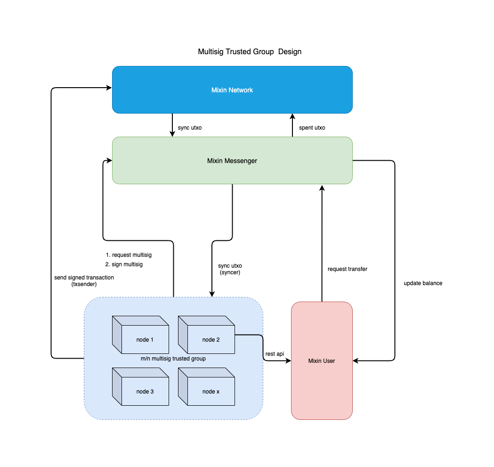
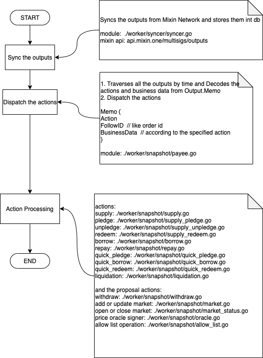
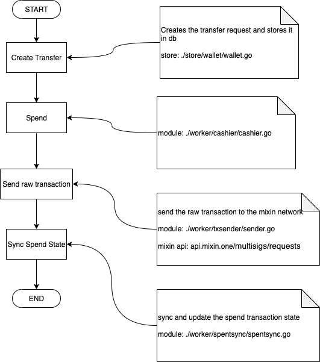
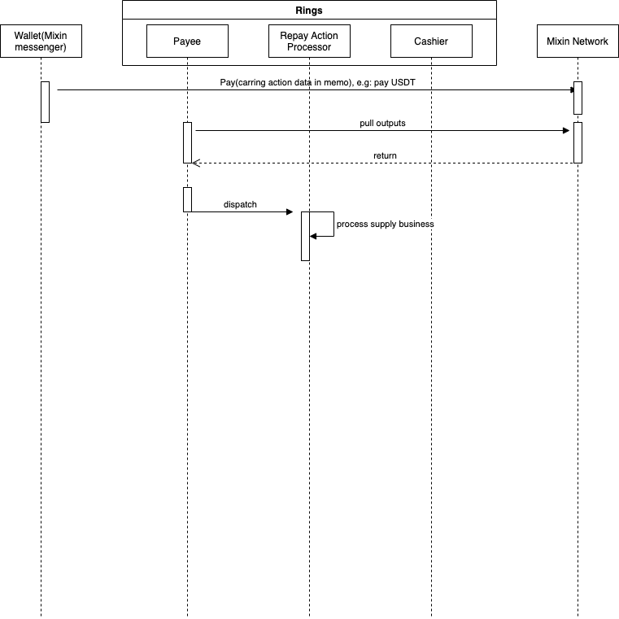
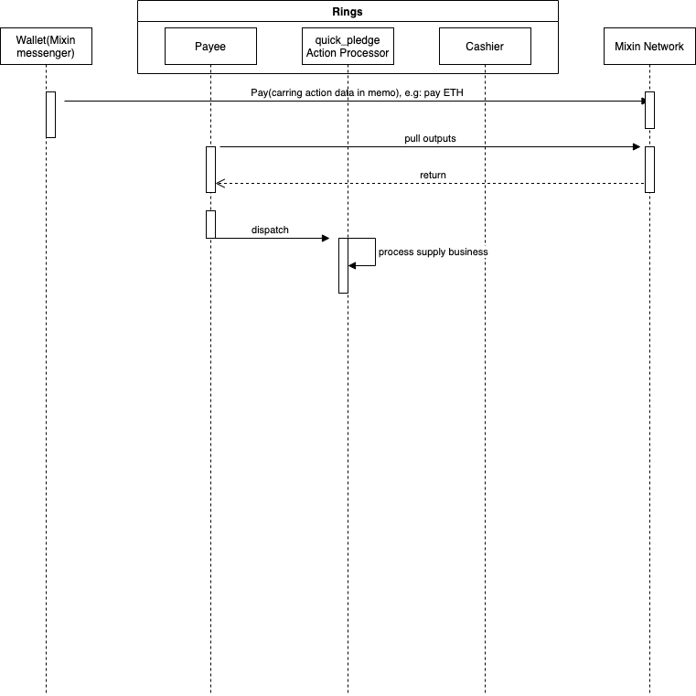
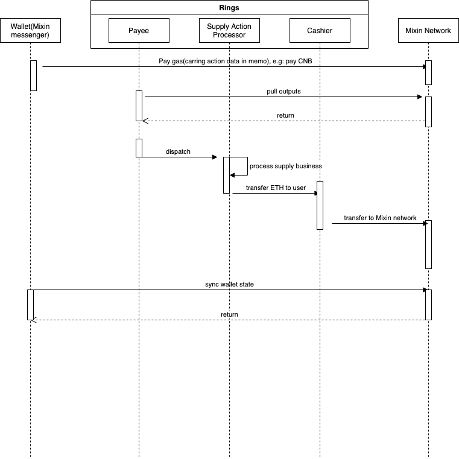
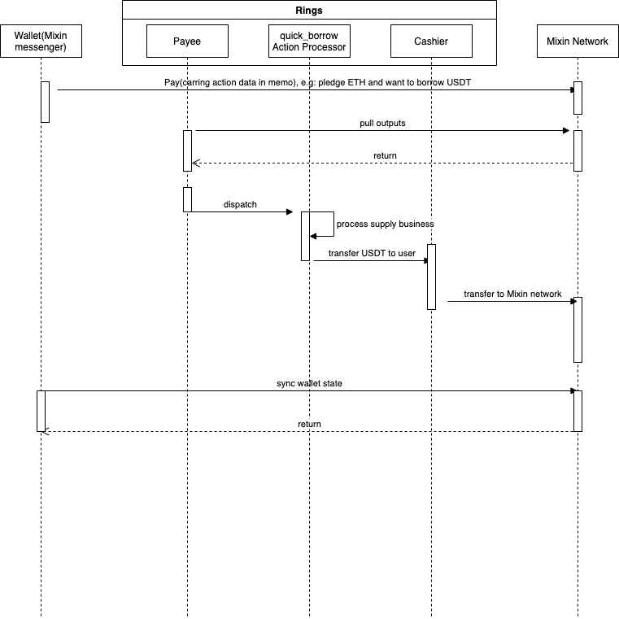
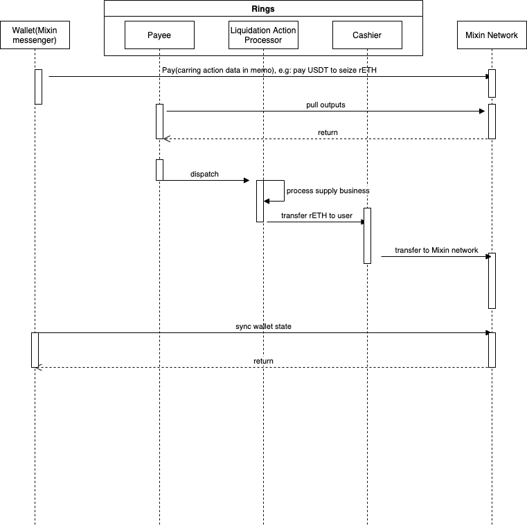
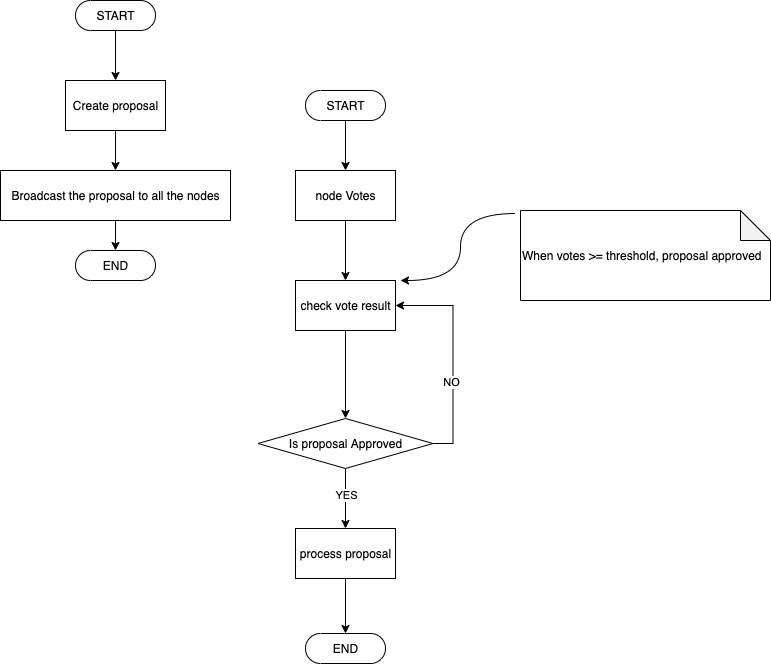

# Design

## Architecture

Rings is an implementation of MTG and a parachain of Mixin network.


#### Mixin MTG struct




#### MTG system data flow
* The user transfers a payment(UTXO) that carries business data to the Mixin network.
* Rings syncs the outputs(UTXO) by parsing the business data(in output.memo)
* Rings dispatchs the business action(included in business data) and processes each action(supply, borrow...)


In MTG system, There are two main roles, one is `Payee`, and the another is `cashier`, All business logic is implemented based on these two roles.

* `Payee` receiving the outputs(transactions), decoding the business data from `Output.Memo`, dispatching `actions`


* `cashier` spending the token, transfering the token to user


#### Rings actions

* `Supply`, Suppose users supply the underlying token `ETH` and gain the equity token `cETH`
  

* `Pledge`, Suppose users pledge the equity token `cETH`, meains that users should pay `cETH` to the Rings system
  

* `Unpledge`, Suppose users unpledge the equity token `cETH`, meains that users should pay some gas `CNB` and will get the equity token `cETH` back
  

* `Redeem`, Suppose users redeem the underlying token `ETH` from the system, means that users should pay equity token `cETH` and whill get the quivalent underlying token `ETH` back
  

* `Borrow`, Suppose users need to borrow the underlying token `USDT`, means that users should pay some gas `CNB` and will gain the expected underlying token `USDT`
  

* `Repay`, Suppose users repay `USDT`, means that users pay `USDT` and the users' debt will be reduced
  

* `quick_pledge`, Suppose users supply the underlying token `ETH` and no equity token `cETH` returns to users
  
* `qick_redeem`, Suppose users redeem `ETH`, users only pay some gas `CNB`, and will get the underlying token `ETH` back
  
* `quick_borrow`, Suppose users can supply `ETH` or `cETH` and can borrow `USDT` directory
  
  

* `Liquidation`, Suppose User A has Pledged `ETH` and Borrowed `USDT`, once The liquidity of user A's account less than or equal zero, it can be liquidated by other users
  

* `Proposal actions`, all governance work produces effects through proposal voting, the current proposals include these: 
    1. `market` for creating market or updating market
    2. `open-market` for opening market
    3. `close-market` for closing market
    4. `allowlist` whether to allow liquidation
    5. `add-oracle-signer` add the price oracle signer that provides market price
    6. `rm-oracle-signer` remove the price oracle signer
    7. `withdraw` withdraw the reserves from the market
   

## Code struct

```

---
|-cmd      
|-config  
|-deploy  
|-docs    
|-core 
|-pkg     
|-service 
|-store   
|-worker  
|-handler    
|-Dockerfile 
|-Makefile
|-main.go 

```

* [cmd](../cmd) command entry, including start api server and worker and governance tools
* [config](../config) default config directory
* [docs](../docs) project documents
* [core](../core) directory of project's models
* [pkg](../pkg) project packages that can be exported
* [service](../service) directory of business codes
* [store](../store) data repository(data may be stored in database or redis or memory cache)
* [worker](../worker) directory for jobs that processing data in background
* [handler](../handler) just for exported apis
* [Dockerfile](../Dockerfile) for deployment
* [deploy](../deploy) store configs and tools of deployment
* [main.go](../main.go)
* [Makefile](../Makefile)

### [configuration template](../deploy/config.node.yaml.tpl)

```
# Fixed value : 1603382400 
genesis: 1603382400
# time localtion
location: Asia/Shanghai

# data base config
db:
  dialect: mysql
  host: ~
  read_host: ~
  port: 3306
  user: ~
  password: ~
  database: ~
  location: Asia%2FShanghai
  Debug: true

# mixin dapp config
dapp:
  num: 7000103159
  client_id: ~
  session_id: ~
  client_secret: ~
  pin_token: ~
  pin: ""
  private_key: ~

# nodes group config
group:
# private key shared by all nodes, that generated by the command: ./compound keys --cipher ed25519
  private_key: ~
  # The private key used by the current node for user data signing
  sign_key: ~
  # administratories of thie node
  admins:
    - ~
    - ~
    - ~ 
  # Node member
  members:
    - client_id: ~
    # The public key used by the current node to verify the signature
      verify_key: ~
  threshold: 2
  vote:
    asset: 965e5c6e-434c-3fa9-b780-c50f43cd955c
    amount: 0.00000001
```

#### [Rest APIs](../handler/rest/rest.go) exported for application layer, including:

```
/markets/all   //response all markets
/transactions  //response compound transactions
/price-requests // for price oracle calling
```

#### Worker
* [cashier](../worker/cashier/cashier.go) Processes the pending transfers. prepare for transfering a transaction to Mixin network.
* [syncer](../worker/syncer/syncer.go) Syncs the outputs(UTXO) from Mixin network.
* [txsender](../worker/txsender/sender.go) Transfers raw transaction to Mixin network.
* [spentsync](../worker/spentsync/spentsync.go) syncs and updates the transfer state.
* [priceoracle](../worker/priceoracle/priceoracle.go) Fetches a price and put the price on the chain.
* [payee](../worker/snapshot/payee.go) processes outputs and dispatches business actions.

#### Action processing
* [borrow](../worker/snapshot/borrow.go) handles the borrow action event.
* [supply](../worker/snapshot/supply.go) handles the supply action event.
* [pledge](../worker/snapshot/supply_pledge.go) handles the pledge action event.
* [unpledge](../worker/snapshot/supply_unpledge.go) handles the unpledge action event.
* [redeem](../worker/snapshot/supply_redeem.go) handles the redeem action event.
* [repay](../worker/snapshot/borrow_repay.go) handles the repay action event.
* [liquidation](../worker/snapshot/liquidation.go) handles the liquidation action event
* [proposal](../worker/snapshot/proposal.go) handles and dispatches the proposal actions, include: adding market, updating market, closing or opening market, adding or removing allowlist, withdraw
* [price](../worker/snapshot/price.go) handles the price protocal action event.


### Market Trade-Curbing Mechanism

> Close the market when the price of a certain market is abnormal.

* When the price of a market is maliciously attacked, managers have the right to execute the `close-market` order and apply for a closed-market vote. If the request is approved, the market will be closed.
* Trades are prohibited in closed markets.
* However, as long as there are closed markets, liquidation of all markets will be prohibited, because liquidation will affect the liquidity of all market accounts of users.

## The implementation of compound protocol 

* [Interest rate model](../internal/compound/interest_rate_model.go) is The core implementation of compound protocol.

* [Borrow balance](../core/borrow.go) user borrow balance contains borrow principal and borrow interest. `balance = borrow.principal * market.borrow_index / borrow.interest_index`

* [Accrue interest](../service/market/market.go) Accruing interest only occurs when there is a behavior that causes changes in market transaction data, such as supply, borrow, pledge, unpledge, redeem, repay, price updating. And Only calculated once in the same block.

```
	blockNumberPrior := market.BlockNumber

	blockNum, e := s.blockSrv.GetBlock(ctx, time)
	if e != nil {
		return e
	}

	blockDelta := blockNum - blockNumberPrior
	if blockDelta > 0 {
		borrowRate, e := s.curBorrowRatePerBlockInternal(ctx, market)
		if e != nil {
			return e
		}

		if market.BorrowIndex.LessThanOrEqual(decimal.Zero) {
			market.BorrowIndex = borrowRate
		}

		timesBorrowRate := borrowRate.Mul(decimal.NewFromInt(blockDelta))
		interestAccumulated := market.TotalBorrows.Mul(timesBorrowRate)
		totalBorrowsNew := interestAccumulated.Add(market.TotalBorrows)
		totalReservesNew := interestAccumulated.Mul(market.ReserveFactor).Add(market.Reserves)
		borrowIndexNew := market.BorrowIndex.Add(timesBorrowRate.Mul(market.BorrowIndex))

		market.BlockNumber = blockNum
		market.TotalBorrows = totalBorrowsNew.Truncate(16)
		market.Reserves = totalReservesNew.Truncate(16)
		market.BorrowIndex = borrowIndexNew.Truncate(16)
	}

```